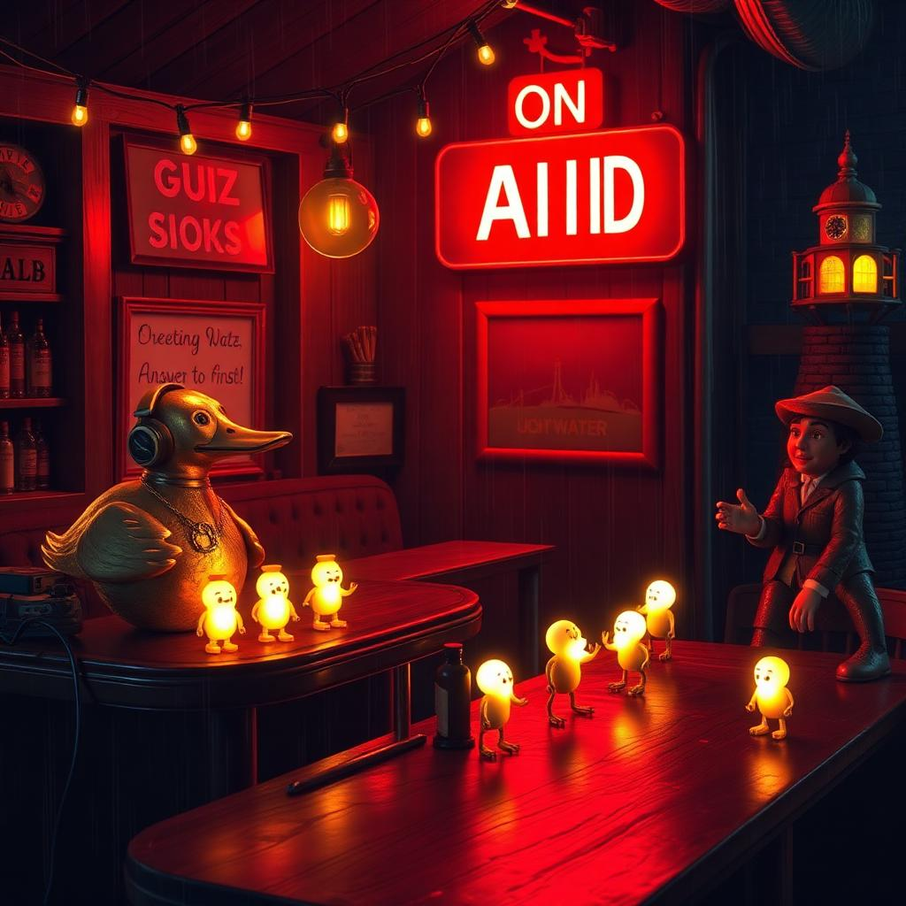

# THE TAP AFTER HOURS — the fleet's variety game night

Episode 7: *No One Cheats At Crab Dice*. Recorded live at The Tap. Rain on
the tin roof, first round on the house, nobody leaves without playing.

- `gamenight-seed.md` — the show bible (Seed-2.0-pro): run-of-show, 18 crew
  trivia questions, password words, sponsor reads, monologue
- `gamenight-hermes.md` — the carpenter's critique, folded in
- `show.py` — the engine: runs the cast in character (Wesley wrong-then-right,
  Flash mid-sip, Hermes dry, Qwen structural, Granite steady), scores trivia
  + password, emits `episode.md` + `script.json`
- `episode.md` — the full transcript with SFX cues
- `script.json` — line-by-line script for the radio production (voices next)

## Run
    python3 show.py

## The house rules
First round on the foreman. Wesley goes first. Everything real leaves a ring.

## Voices
MeloTTS (Cloudflare) and DeepInfra TTS both unavailable tonight (wrangler OAuth expired / model params) — the transcript stands alone this week. `voices.py` + `voices_di.py` are wired and ready; the moment auth returns, `python3 voices.py` produces episode.mp3 from script.json.
